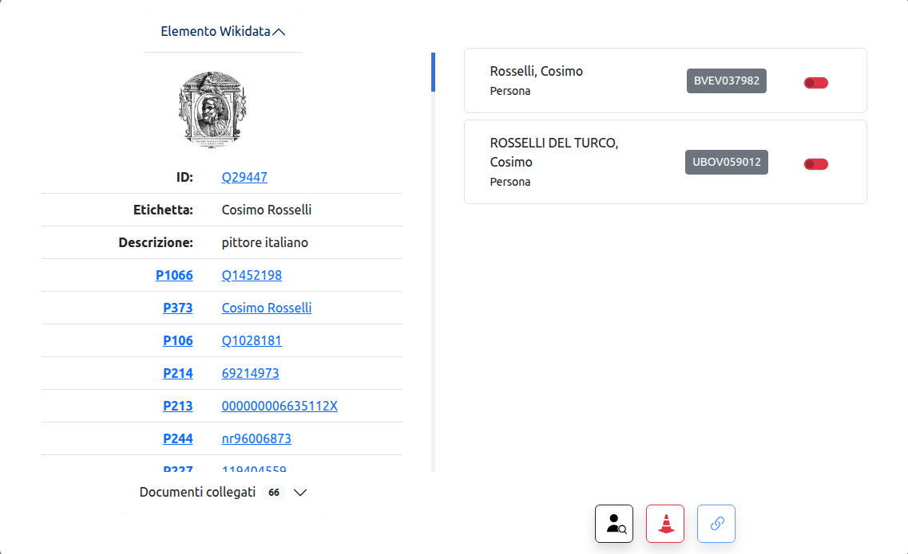

# WikiPlayground 2.0
Gioco per la riconciliazione delle entità SBN con gli Items Wikidata

> Per poter utilizzare il gioco è necessario aver eseguito il login in Wikidata, anche da un'altra scheda del browser, e aver scaricato l'estensione WAPI
<br>

## Link utili
| Link | Descrizione |
| --- | --- |
| [WAPI](https://chromewebstore.google.com/detail/lmjpfcjpoifmnfenlbnmgijkegiddmjg) | Estensione per browser |
| [GitHub](https://github.com/logo94/WikiPlayground2.0) | repository codice |
| [Q132260000](https://www.wikidata.org/wiki/Q132260000) | elemento Wikidata applicazione |
| [Property talk:P396](https://www.wikidata.org/wiki/Property_talk:P396) | pagina progetto ICCU |
| [Laboratorio Stelline 2025](https://github.com/labaib/WikiPlayground) | pagina Wikidata del laboratorio organizzato in occasione del Convegno delle Stelline 2025 |
<br>

## Requisiti
1. [Brave browser](https://brave.com/download/): browser basato su Chromium che blocca automaticamente i messaggi per la gestione dei cookies;
2. [WAPI](https://chromewebstore.google.com/detail/lmjpfcjpoifmnfenlbnmgijkegiddmjg): estensione per browser, le richieste all'OPAC SBN effetuate dal gioco sono bloccate dai server ICCU per la violazione delle policy CORS (Cross-Origin Resource Sharing), per esegire comunque la chiamata è necessario il ricorso ad un'estensione per browser che esegua le chiamate al posto del gioco;
3. Account [Wikidata](https://www.wikidata.org/w/index.php?&title=Special:UserLogin)
4. Il browser potrebbe bloccare di default cookies di terze parti, indispensabili per l'autenticazione in Wikidata. Assicurarsi di abilitare tutti i cookies per la pagina (brave: icona leone > Controlli avanzati > Consenti tutti i cookie )
<br>

## Come funziona
Partendo da una query preimpostata o personalizzata, il gioco esegue una query SPARQL per ottenere una lista di elementi Wikidata privi della proprietà `P396`:

```
# SPARQL Query
SELECT ?item
WHERE {

    # Filtra gli item con cittadinanza italiana (Q38) o italiana (Q172579)
    VALUES ?v { wd:Q172579 wd:Q38 }
    ?item wdt:P27 ?v ;  # P27 = paese di cittadinanza
          wdt:P214 [] . # P214 = identificativo VIAF

    # Filtra per etichette in italiano
    ?item rdfs:label ?itemLabel . FILTER(LANG(?itemLabel) = "it")

}
LIMIT 20
```
Alla query verranno aggiunti automaticamente in seguenti filtri:

Esclusione degli item che hanno una proprietà P396
```
FILTER NOT EXISTS { ?item wdt:P396 [] . }
```

Esclusione degli item che hanno una proprietà P396 uguale a novalue
```
FILTER NOT EXISTS { ?item a wdno:P396 . }
```

Gli elementi trovati vengono tornati come lista in cui sono disponibili alcune informazioni di base, un tasto per accedere all'elemento e un contatore che riporta il numero di match trovati all'interno dell'OPAC SBN.

Accedendo al dettaglio di un elemento si apre una scheda suddivisa in due: 

<div align="center"></div>

Sulla sinistra sono riportate le informazioni sull'elemento Wikidata e la lista di titoli associati ottenuti tramite il VIAF

Sulla destra sono riportati candidati ottenuti dall'OPAC SBN, cliccando sull'ID si accede alle informazioni di base sull'autore e i titoli documenti collegati. Se c'è il match tra i titoli presenti nel VIAF e i titoli presenti in OPAC il titolo verrà evidenziato in verde

Una volta selezionati uno o più match, per mezzo del bottone azzurro viene aggiunto all'elemento di partenza un claim contenente la proprietà P396 e relativo valore. La voce viene referenziata per mezzo della proprietà P1810 che riporta la forma dell'etichetta presente nell'OPAC e la data di consultazione. 

Al termine dell'operazione di aggiornamento si aprirà in una nuova scheda del browser la pagina relativa all'Item aggiornato.

Quando una ricerca produce 0 risultati è possibile inserire il valore novalue per la proprietà P396 in modo da tenere traccia delle entità già consultate, l'elemento verrà quindi escluso per le future richieste

Ad ogni modifica eeguita tramite il gioco viene attribuito un edit summary dal valore "WikiPlayground"
<br>


### Bottoni
| Icona | Funzione |
| --- | --- | 
| &nbsp;<div align="center"></div>&nbsp; | vai alla ricerca avanzata dei nomi in SBN |
| &nbsp;<div align="center"></div>&nbsp; | inserisci proprietà P396 con valore ID SBN |
| &nbsp;<div align="center"></div>&nbsp; | segnala errore in OPAC |
| &nbsp;+&nbsp; | inserisci `novalue` come valore della proprietà P396  |
| &nbsp;<-&nbsp; | ritorna a lista risultati OPAC |
<br>

