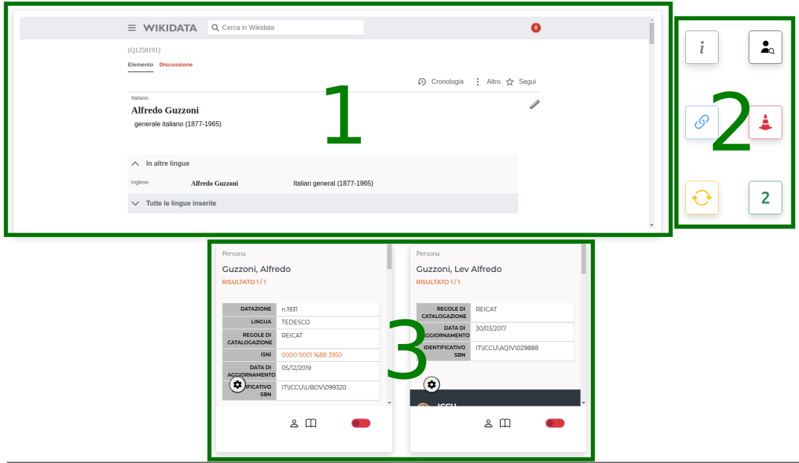

# WikiPlayground
Gioco per la riconciliazione delle entità SBN con gli Items Wikidata

> Per poter utilizzare il gioco è necessario aver eseguito il login in Wikidata, anche da un'altra scheda del browser
<br>

## Link utili
| Link | Descrizione |
| --- | --- |
| [WikiPlayground](https://labaib.github.io/WikiPlayground/) | pagina web applicazione |
| [GitHub](https://github.com/labaib/WikiPlayground) | repository codice |
| [Q132260000](https://www.wikidata.org/wiki/Q132260000) | elemento Wikidata applicazione |
| [Property talk:P396](https://www.wikidata.org/wiki/Property_talk:P396) | pagina progetto ICCU |
| [Laboratorio Stelline 2025](https://www.wikidata.org/wiki/Wikidata:Gruppo_AIB_TBID/Stelline/2025) | pagina Wikidata del laboratorio organizzato in occasione del Convegno delle Stelline 2025 |
<br>

## Requisiti
1. [Brave browser](https://brave.com/download/): browser basato su Chromium che blocca automaticamente i messaggi per la gestione dei cookies;
2. [CORS Unblock](https://chromewebstore.google.com/detail/cors-unblock/lfhmikememgdcahcdlaciloancbhjino?pli=1): estensione per browser, le richieste all'OPAC SBN effetuate dal gioco sono bloccate dai server ICCU per la violazione delle policy CORS (Cross-Origin Resource Sharing), per esegire comunque la chiamata è necessario il ricorso ad un'estensione per browser che esegua le chiamate al posto del gioco;
3. Account [Wikidata](https://www.wikidata.org/w/index.php?&title=Special:UserLogin)
<br>

## Come funziona
Il gioco esegue una query SPARQL in modo da ottenere un elemento Wikidata casuale:

```
# SPARQL Query
SELECT DISTINCT ?item ?itemLabel
WHERE
{
    # Filtra gli item con cittadinanza italiana (Q38) o italiana (Q172579)
    VALUES ?v { wd:Q172579 wd:Q38 }
    ?item wdt:P27 ?v ;  # P27 = paese di cittadinanza
            wdt:P214 [] . # P214 = identificativo VIAF

    # Filtra per etichette in italiano
    ?item rdfs:label ?itemLabel . FILTER(LANG(?itemLabel) = "it")

    # Esclude gli item che hanno una proprietà P396
    FILTER NOT EXISTS { ?item wdt:P396 [] . }

    # Esclude gli item che hanno una proprietà P396 uguale a novalue
    FILTER NOT EXISTS { ?item a wdno:P396 . }
}
OFFSET ${i}
LIMIT 1
```

L'etichetta dell'elemento estratto viene utilizzata per la ricerca di match all'interno dell'OPAC SBN, tutti i match trovati vengono rappresentati per mezzo di un box, ogni box permette di accedere alla pagina dell'OPAC, consultare le pubblicazioni associate al match e selezionare le voci da importare in Wikidata. 

Una volta selezionati uno o più match, per mezzo del bottone azzurro viene aggiunto all'elemento di partenza un claim contenente la proprietà P396 e relativo valore. La voce viene referenziata per mezzo della proprietà P1810 che riporta la forma dell'etichetta presente nell'OPAC e la data di consultazione. 

Al termine dell'operazione di aggiornamento si aprirà in una nuova scheda del browser la pagina relativa all'Item aggiornato.

Quando una ricerca produce 0 risultati è possibile inserire il valore novalue per la proprietà P396 in modo da tenere traccia delle entità già consultate, l'elemento verrà quindi escluso per le future richieste

Ad ogni modifica eeguita tramite il gioco viene attribuito un edit summary dal valore "WikiPlayground"
<br>


### Componenti

La pagina si articola in due 3 blocchi di contenuti:

<div align="center">
  
</div>
<br>

1. iFrame contente l'elemento wikidata selezionato casualmente
2. bottoni per l'interazione con la pagina
3. lista dei match trovati nell'OPAC SBN
<br>


### Bottoni
| Icona | Funzione |
| --- | --- | 
| &nbsp;<div align="center"></div>&nbsp; | accedi alle informazioni sull'applicazione e alle statistiche |
| &nbsp;<div align="center"></div>&nbsp; | vai alla ricerca avanzata dei nomi in SBN |
| &nbsp;<div align="center"></div>&nbsp; | inserisci proprietà P396 con valore ID SBN |
| &nbsp;<div align="center"></div>&nbsp; | segnala errore in OPAC |
| &nbsp;<div align="center"></div>&nbsp; | carica il prossimo elemento casuale |
| &nbsp;<div align="center"></div>&nbsp; | status / numero di match trovati in OPAC |
<br>


### Scheda candidato OPAC SBN
<br>

<div align="center">
  
</div>
<br>

A. IFrame pagina OPAC SBN<br>
B. Link alla pagina OPAC relativa alla persona<br>
C. Link alle pubblicazioni della persona <br>
D. Switch per la selezione del match per l'import automatico di ID e Label in Wikidata<br>


### Future implementazioni
* Aggiunta dinamica della query di partenza
* Gestione dinamica del dominio (per istanze Wikibase)
